<!-- [//]:(pdf_document or  rmarkdown::html_vignette in output) -->
<!-- [//]:(use build_vignettes() from devootls - I think this will actually include the vignette in the package) -->

```{r setup, include=FALSE}
knitr::opts_chunk$set(cache=TRUE)
```


# Background

This document is an embryonic vignette for the `esteban` R package. The further development of this work, the HIV/ART structure and package development was funded by [TB-MAC](http://www.tb-mac.org)


# Rationale

Tuberculosis (TB) burden includes incidence, mortality and prevalence. Most often estimates of incidence are based on notification data (cases of TB detected and reported to authorities), inflated by a factor to reflect an imperfect case detection rate (CDR). Deaths due to TB may be coded with TB as the cause in vital registration (VR) systems, but as with notifications, VR data will differ from the true mortality due to TB. Well-conducted prevalence surveys provide an unbiased estimate of TB prevalence, but are expensive. Recently there has been a number of TB prevalence surveys undertaken, particularly in high-burden settings with imperfectly functioning detection/notification systems and imperfect or absent VR systems. Making estimates about one facet of burden from data on another relies on modelling assumptions on the relationships between then (e.g. case-fatality assumptions to relate incidence to mortality). The aim of this project is to develop a statistically rigorous transmission-modelling framework that allows for all the available data to be used to make statements about all aspects of burden.


## Model structure

The model is a stochastic age-, sex- and HIV/ART-structured transmission model. The demographic and HIV/ART structure are described in the next section. The model is stochastic because the number of each events occurring at each time step is a random variable, but also because of the priors for the case-detection and death-detection trajectories arise from stochastic processes. More specifically, the parameters specifying the probability a case incident at time $t$ is notified ($CDR_t$) and of a death at time $t$ appearing in the vital registration data ($VR_t$) are treated as random variables obeying a geometric Brownian motion, e.g.:

$$ \log(CDR_{t+1}) = \log(CDR_t) + \text{d}CDR + \frac{\epsilon_t}{\theta} $$
$$ \epsilon_t \sim N(0,1) $$

Various deterministic approximations to the model are used to approximate the marginal likelihood for inference.

### TB structure

Figure 1 below gives an overview of how the TB model is organised: the red boxes represent observed quantities ($Y$ in the notation below), squares represent counts whereas diamonds represent rates. True mortality (2) shows up in the VR system (1); prevalent TB (5) resolves either in notification (4) or non-notification; the prevalent pool of TB (whether destined for notification or not) may be sampled in a prevalence survey (5); incidence arises from the underlying population state ($X_t$ here not to be confused with the notation for unobserved variables below), influenced by prevalence via the force-of-infection (7); and finally, the force-of-infection also influences the underlying population state at future times by changing the proportion of each category latently infected with the TB bacillus (9).

Each disease state inherits the structure from the underlying population, which is described in the next section.

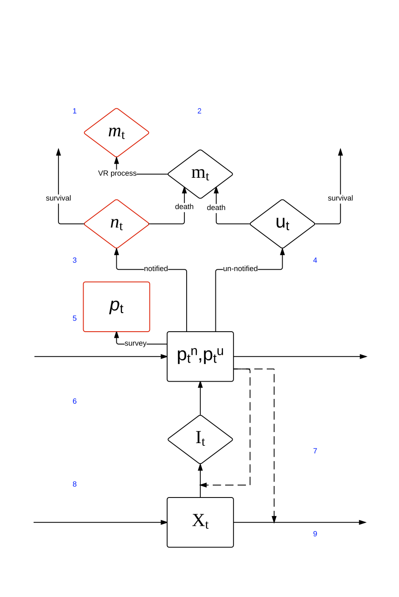

<!-- \pagebreak -->

### Demographic & HIV/ART structure

Since many of the settings where this approach may be most useful (i.e. places where a prevalence survey has been undertaken) have TB epidemiology strongly influenced by HIV, it is important to include details of the HIV epidemic. UNAIDS estimates of HIV infection and ART coverage are carried out in countries using a model-based analysis using the EPP and AIM models, developed and maintained by Avenir Health. Both because these models include natural histories supported by analyses of large HIV cohorts, and because we would like our underlying HIV epidemiology to be as close to the UNAIDS estimates as possible, we re-implemented a simplified version of Avenir's AIM model to account for underlying demography and HIV/ART epidemiology.

This means that there are 81 age categories, 8 HIV infection states (uninfected, and then 7 CD4 cell count categories), 4 ART treatment categories (none, 0-6 months, 7-12 months >12 months), and 2 sexes, for a total of 5,184 states. The time-step used is 0.1 years, and the model is typically run over 45 years to start before the HIV epidemic. The Avenir/UNAIDS HIV prevalence and ART coverage data are used as inputs to achieve the overall levels of infection in the model, and the mortality by sex, age, CD4 cell count and HIV/ART status is then applied together with birth rates from UN Population Division.

### Implementation

The underlying model is implemented in Fortran 90 for speed and wrapped in the form of a package for the R statistical computing language/environment. R random number streams are used, but a separate library for onward random deviate generation has been written: setting R seeds will fix behaviour on a machine; but results may be platform-dependent.

# Installation and use

## Installation

A user must first install an up-to-date version of R and `devtools` by typing

```{r,eval=FALSE}
install.packages('devtools')
```

Since the model uses compiled code, R development tools must also be present.

Then model dependencies should be installed first by typing

```{r,eval=FALSE}
devtools::install_github('petedodd/esteban',dependencies=TRUE,build_vignettes=FALSE)
```

Alternatively, the codebase can be downloaded, and the package built and installed using `R CMD build` and `R CMD INSTALL` in the standard fashiong. The `--no-build-vignettes` option for `build` is recommended as this vignette is slow to run.


<!-- &nbsp; -->

## Use

In order to execute the examples below, the following packages will need to be loaded:

```{r, eval=TRUE}
library(esteban) # this package
```

Once the functions included and their names/details are finalised, help will be available by typing `?function_name` at the R command prompt. Similarly, the finalized vignette will be bundled with the package and can be opened from the R command line.


# The example of South Africa

## Running the model

Various forms of data are included with the package:

- UN Population division demographic data
- Life-tables by country, sex, age, year
- Birth and migration rates by time and country
- UNAIDS HIV prevalence and ART coverage estimates
- data on HIV/ART related survival and progression by CD4 county, age, sex, and region from Avenir's AIM model

The TB and mortality data are from 2014.

To look up and prepare data for a specific country to use in the model (specified by the 3 letter ISO code), you can call

```{r, eval=TRUE}
P <- getCountryAimParms('ZAF')       #South Africa = ZAF
```
which also carries out some one-off pre-computations and reshaping of data for model use. The object `P` then contains all the non-TB parameters relevant to South Africa
and its demography and patterns of HIV/ART.

The model also requires a list of parameters relevant to TB. A matrix with ranges for these parameters is included as `rngs`. A parameter list corresponding to these midpoints can be generated by

```{r, eval=TRUE}
tbp <- as.list(rowMeans(rngs))

```


To set the random number behaviour, we can set R's random number seed:

```{r,eval=TRUE}
set.seed(1234)
```

To run the model one types
```{r, eval=TRUE}
test <- AimDynFLD(P,tbp,stoch=TRUE,coarse = TRUE,graph=FALSE) #stochastic version
```
which should take about 0.2s. The `stoch` option sets the TB model to use the stochastic version. The `coarse` option should normally be used, and uses a longer time-step for the TB model than for the underlying demographic model. Running the model with `coarse=FALSE` uses the 0.1 year time-step and takes much longer to run as tens of thousands of random numbers are needed for each iteration due to the large dimension of the population state space.

## Diagnostic demographic/HIV output graphs

If the above command is run with the option `graph=TRUE` various pdf plot outputs will be saved to the working directory as checks that the demographic model is working well. These include the following graphs (Figures 2-7):


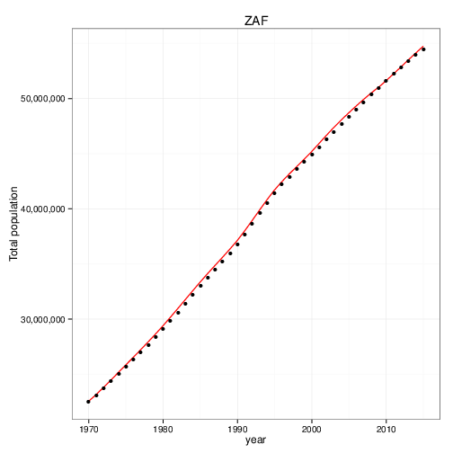

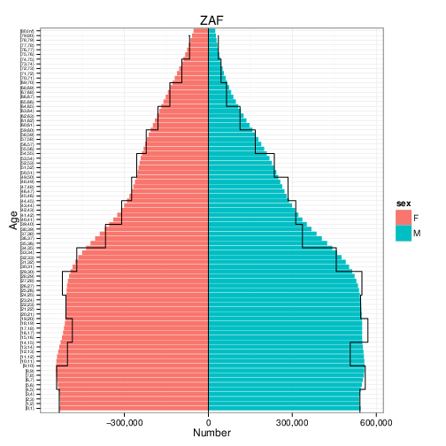

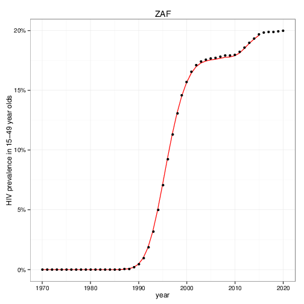

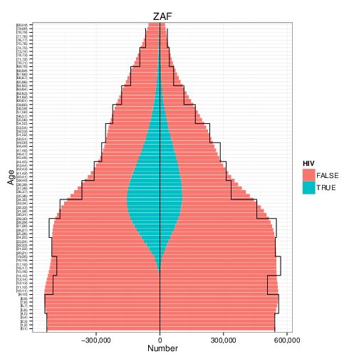

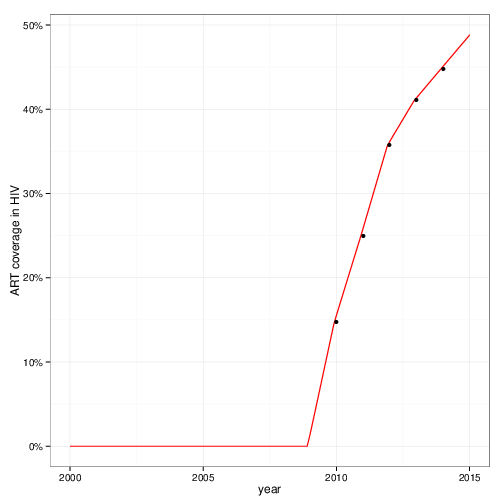

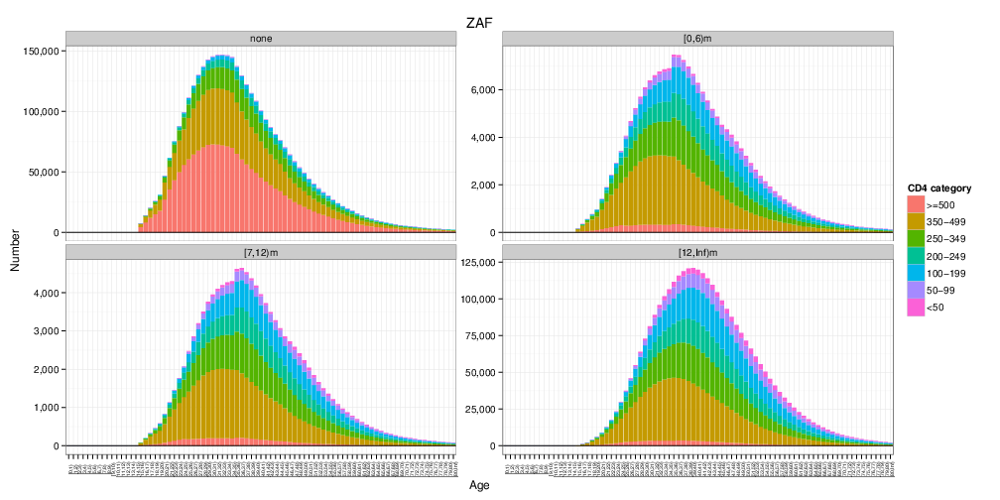


<!-- [//]:() -->
<!-- [//]:() -->
<!-- [//]:() -->
<!-- [//]:() -->
<!-- [//]:() -->
<!-- [//]:() -->
<!-- [//]:() -->


\pagebreak


## Working with the model ##

The main function for working with the model is `condsimmer`. The name is from CONditional SIMulator, but it can be used for various purposes. First, let's work with a country that has prevalence survey data:

```{r, eval=TRUE}
P <- getCountryAimParms('MWI')       #MWI = Malawi
```

### Inspecting the data ###

If the number of runs is set to zero, it can be used for simply inspecting the data:

```{r, eval=FALSE,fig.width=7, fig.height=7,fig.pos="H"}
testocsp <- condsimmer(dat=P$dat,n=0,P,tbp,show=TRUE,truedat=NULL,V=P$V,
                        west=1,stoch=0,coarse = 1) #n=0 just show data

```
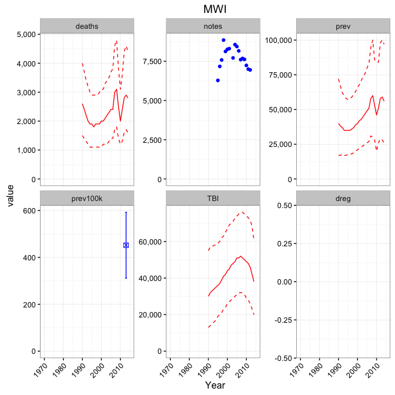

With `west=1` the WHO estimates are also plotted (red lines). N.B. WHO mortality shown is TB deaths in HIV-negative people only whereas the model output includes mortality due to HIV-positive TB cases.


### Calibrating the model ###

N.B. Many of the following examples are relatively slow (a few minutes for this section, perhaps nearer 15 minutes for the MCMC stage in the next section). Where minutes are needed to run, I have warned by writing SLOW.

To calibrate the TB model parameters by searching for the maximum a posteriori (MAP) value, one uses the following function (SLOW):

```{r, eval=FALSE}
mappar <- getMAP(P)
```

Then one can use `condsimmer` in deterministic mode to check the associated dynamics.

```{r, eval=FALSE,fig.width=7, fig.height=7,fig.pos="H"}
testocsp <- condsimmer(dat=NULL,n=1,P,mappar$par,show=TRUE,truedat=P$dat,V=P$V,
                        west=1,stoch=0,coarse = 1) #n=1 deterministic version
```

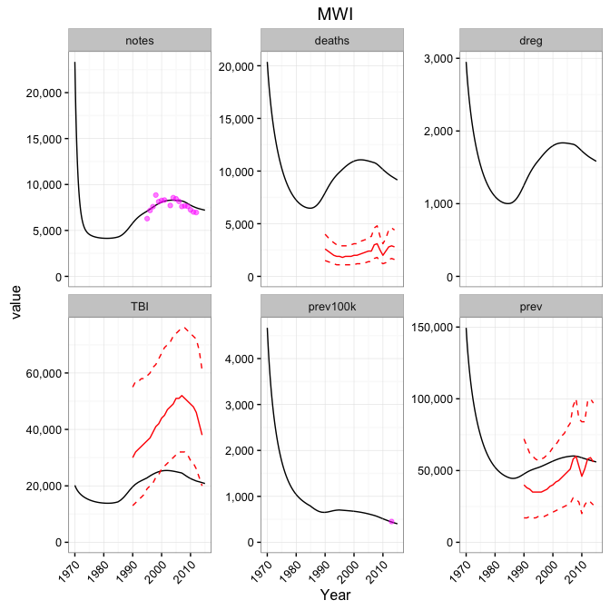

N.B. by using `truedat`, we see the supplied data without conditioning on it. It is important in deterministic mode that `dat=NULL` or a dimension mis-match error will occur. `truedat` can also differ from `dat` and be used for simulation studies.

### Parameter uncertainty for the model ###

To generate a sample from the posterior around this MAP estimate, one uses an MCMC routine (V.SLOW):

```{r, eval=FALSE}
testmc <- runMCMC(mappar$par,P)
```

This is a parallel adaptive MCMC routine that by default takes 200 steps with `NW=20` chains. To pick a thinned sample from after a burn in period, one can use the following utility function:

```{r, eval=FALSE}
mcsamp <- prepMCMC(testmc,nsamps=150,burnin=150)

```


The uncertainty associated with the parameter uncertainty can be visualized by running the deterministic model for 100 parameter sets and graphing (moderately SLOW):

```{r, eval=FALSE,fig.width=7, fig.height=7,fig.pos="H"}
testocsp <- condsimmer(dat=NULL,P,mcsamp[1:100,],show=TRUE,truedat=P$dat,V=P$V,
                        west=1,stoch=0,coarse = 1) # deterministic version

```
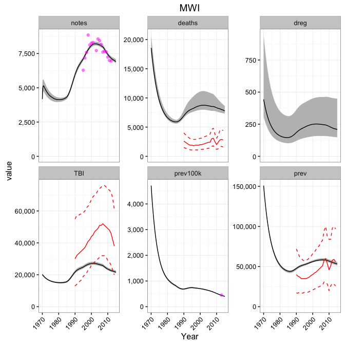

N.B. Supplying a `data.frame` of parameters overrides `n` to be the number of runs.

### Conditioning output on the data ###

One can also condition the stochastic version of the model on the observed data, across a range of sampled parameter values. The runs conditioned on the observations agree very precisely with the notification data, but are more uncertain away from data.

```{r, eval=FALSE,fig.width=7, fig.height=7,fig.pos="H"}
testocsp <- condsimmer(dat=P$dat,P,mcsamp[1:150,],show=TRUE,truedat=P$dat,V=P$V,
                        west=1,stoch=1,coarse = 1) #conditioned

```
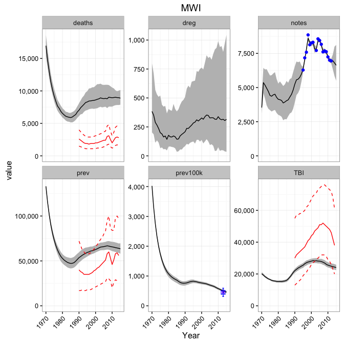

## Other details ##

### Model parameters and meanings ###

| Name  | Interpretation |
|-------|-----------------------------------------------------|
| foi   |initial foi - parametrizes initial state |
| v | protection (0=complete protection) |
|  pr                               | primary progression (probability) |
|  eps                         | endogenous activation (rate per year) |
|  cdr0                           | initial CDR (really probability of detection) |
|  dcdr                          | drift in CDR (per year) |
|  theta                        | precision for noise in CDR (random walk w/ drift) |
|  CFRu                          | untreated CFR (really probability) |
|  CFRd                           | treated CFR |
|  TSu                            | duration untreated |
|  TSd                   | duration treated |
|  VR                   | initial VR CDR (probability of death being in VR) |
| rho   | log-IRR CD4 gradient |
| HRa    | HR protection from ART (established) |
| HCFR00 | CFR no ART no TB treatment |
| HCFR01  | CFR no ART on TB treatment |
| HCFRi0 | CFR early ART no TB treatment |
| HCFRi1  | CFR early ART on TB treatment |
| HCFRe0 | CFR established ART no TB treatment |
| HCFRe1 | CFR established ART on TB treatment |
| HTSu   | duration unnotified TB in PLHIV |
| HTSd   | duration notified TB in PLHIV |


### Inference problem ###

The inference problem can be formalised in a Bayesian setting with the following definitions:

- $X$ the unobserved variables, in this case: TB incidence, mortality and prevalence
- $Y$ the observed variables, in this case: TB notifications, TB vital registrations, and the result from a prevalence survey
- $\theta$ underlying model parameters, in this case: parameters on TB natural history, transmission and detection
- $\pi(\theta)$ a probability distribution quantifying prior beliefs about $\theta$

We would like to develop a posterior distribution for the unobserved burden $X$ given observations $Y$

$$P(X|Y) = \int \text{d}\theta. P(X|Y\theta)P(\theta|Y).$$

The posterior for the underlying model parameters $P(\theta | Y)$ is also of interest an obtained by applying a Bayesian sampling scheme to the marginal likelihood

$$P(Y|\theta) = \int \text{d}X. P(Y|X\theta)P(X|\theta). $$

We will refer to this stage as the *parameter estimation problem*, and refer to the problem of conditionally simulating from the model given a value of $\theta$ sampled from a posterior as the *filtering problem*. These stages are combined to provide an overall uncertain estimate of trajectories, which can be thought of as averaging the uncertain trajectory estimates (conditional on the data) across a range of model parameters (conditional on the data).
